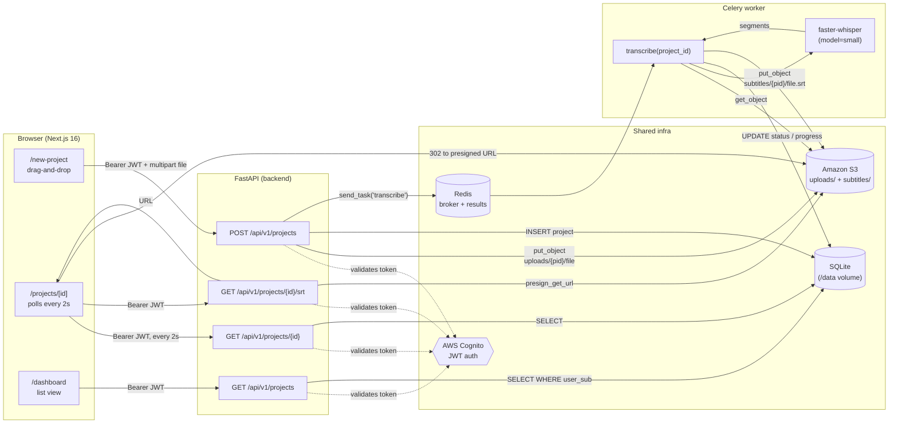
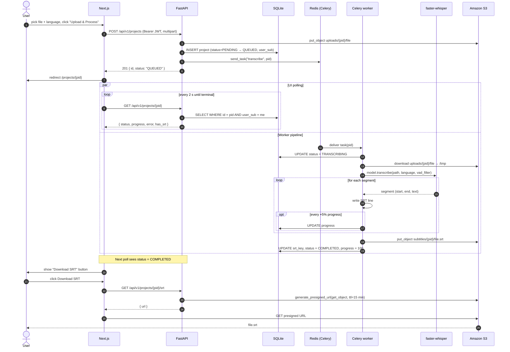
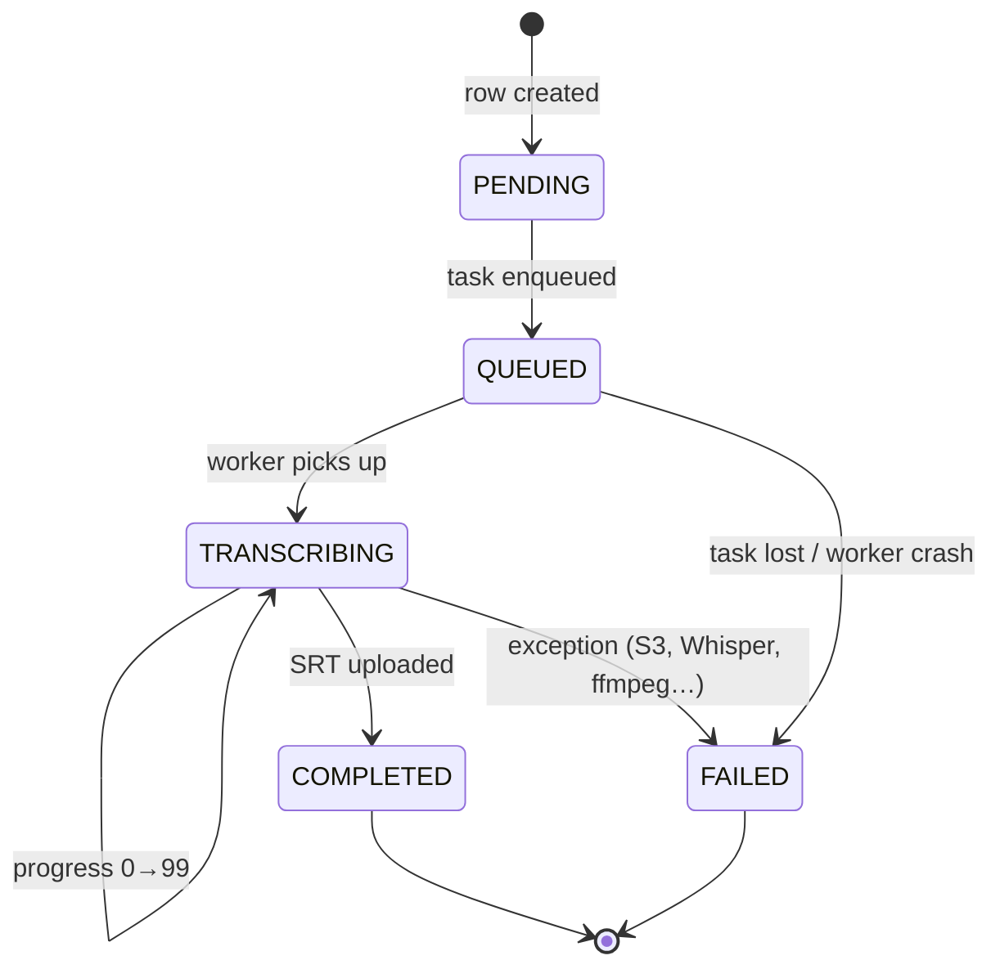

# Subly — Application Flow

End-to-end flow of how a user's media file becomes a downloadable SRT.

---

## 1. High-level architecture

---

## 2. Sequence — upload → transcribe → download

---

## 3. Project status machine

---

## 4. Where each piece of state lives

| State | Lives in | Notes |
|---|---|---|
| User identity (JWT) | Cognito + browser `localStorage` | Validated on every API call |
| Project rows (status, progress, keys) | SQLite at `/data/subly.db` | Shared docker volume between API and worker |
| Uploaded source media | S3 `uploads/{project_id}/<filename>` | Stored only as long as the project exists |
| Generated SRT | S3 `subtitles/{project_id}/<stem>.srt` | Served via 15-min presigned URL |
| Task queue + results | Redis `redis://redis:6379/0` and `…/1` | Celery broker + result backend |
| Whisper model weights | Docker volume `subly-whisper-cache` | Downloaded once on first transcription |
